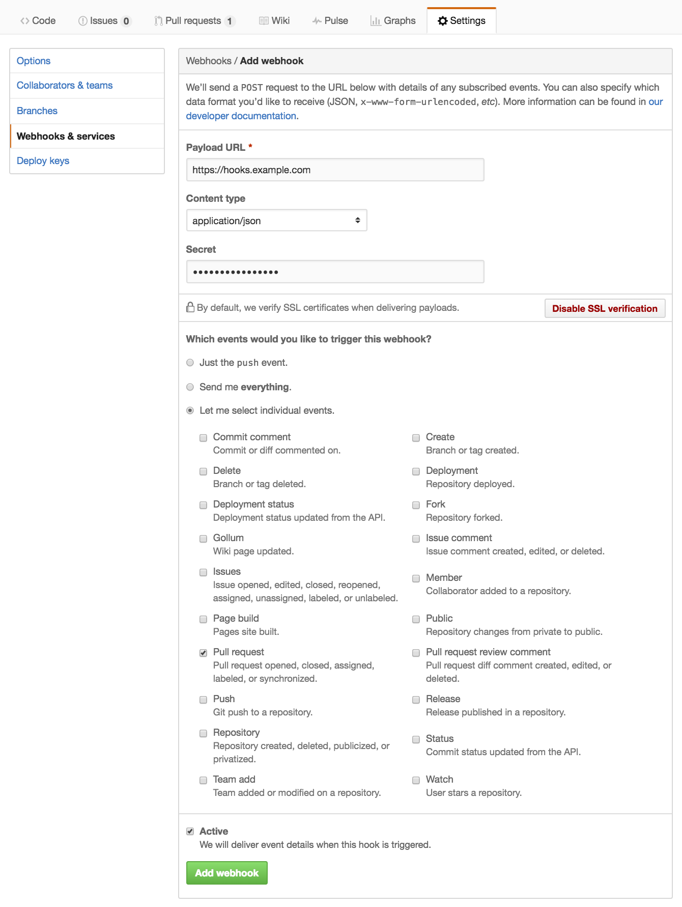

nomaster
========
A small webhook server for shutting down any pull requests argainst a
master branch.

Setup
-----
### Github Webhook Settings
Settings > Webhooks & services > Add webhook

* Payload URL: you probably want to put this service behind a server that
    will handle SSL termination.
* Content type: `application/json` it is!
* Secret: create one and use it.

The only event that needs (*should*) be enabled is **Pull request**:




### Github Authentication Token
Since nomaster will be acting on your behalf to comment on and close pull
requests against master, it will need to be configured with an 
authentication token with sufficient privileges. 

Settings > Personal access tokens > Generate new token

The only scope that the application requires is **repo**.


You may have a robot user that this "Personal Access Token" will belong to.


### nomaster Configuration
`nomaster` can be configured using command line options (see usage below), or
since there are objects of a sensitive nature via a configuration file.

All command-line flags can be set in a configuration, but command-line flags
will override any options in a configuration file. The application searches for
configuration files in the following locations (precedence):

* /etc/nomaster/config.{toml,yaml,json}
* $HOME/.nomaster/config.{toml,yaml,json}

A sample configuration file (toml) is below:

```toml
 token = "ea750bc2deadbeef0aabc209d7d3bea3f2bc72110cd"
 port = 8088
 secret = "shhitsasecret"
 comment = "Don't make a PR against master!"
 ```

